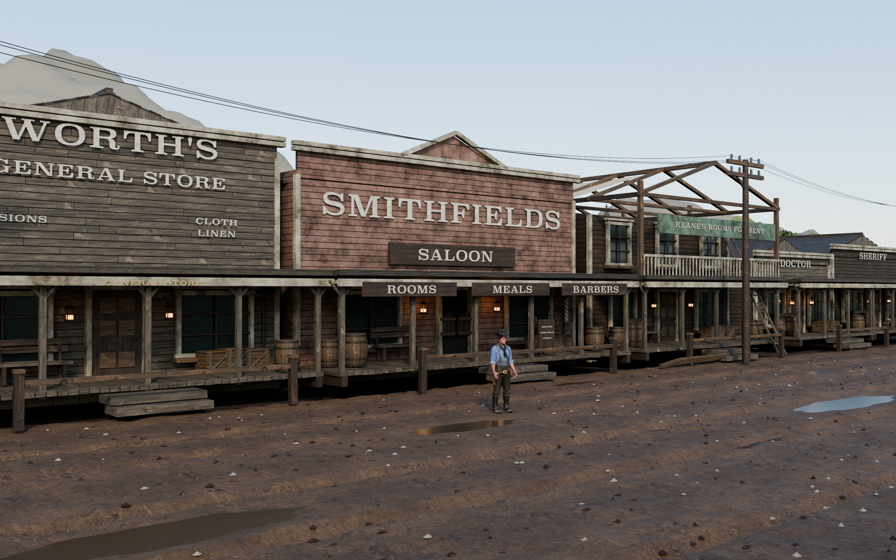

# Valentine — Blender fan scene

Privat arkiv av Valentine-prosjektet: den redigerbare Blender-scenen, Arthur-originalen, saloon-originalen, teksturer, byggekode, referanser, sjekkpunkter og fem ferdige stillbilder.



## Hent prosjektet tilbake

På Macen med GitHub CLI innlogget:

```sh
gh repo clone whoamaiii/valentine-blender-fan-scene
cd valentine-blender-fan-scene
python3 archive.py --restore
open -a Blender valentine/Valentine_Fan_Recreation.blend
```

Første gang må prosjektet **klones**. `git pull` brukes senere når den lokale mappen allerede finnes.

Hovedscenen åpnes direkte etter kloning og har alle 49 teksturbilder pakket inn. Blender 5.1.2 ble brukt til å lage og kontrollere den. Se [START_HER.md](valentine/START_HER.md) for kameraer, navigasjon og innhold.

## Innhold

| Mappe eller fil | Innhold |
| --- | --- |
| `valentine/Valentine_Fan_Recreation.blend` | Siste lagrede versjon fra Blender før arkivering |
| `valentine/renders/` | Fem ferdige bilder på 2560 × 1600 piksler |
| `valentine/scripts/` | Kode for bygging, materialer, rendring og kontroll |
| `valentine/textures/` | Poly Haven-teksturer og kildeinformasjon |
| `valentine/checkpoints/` | Tidligere arbeidsversjoner, inkludert versjonen før siste arkivlagring |
| `artur/source/` | Urørt Arthur-modell og originale teksturer |
| `saloon_with_textures.glb` | Urørt saloon-modell fra oppstarten |
| `preproduction/` | Opprinnelig plan, modellkontroll og prøvebilder |

## Stor arkivfil og gratis lagring

Dette repoet bruker vanlig Git, uten Git LFS, Actions, Packages eller betalt tilleggslagring. Private repoer er inkludert i [GitHub Free](https://docs.github.com/en/repositories/creating-and-managing-repositories/about-repositories).

Den eldre kontrollscenen `preproduction/Asset_Review.blend` er 111 718 661 byte og overskrider [GitHubs grense på 100 MiB per vanlig Git-fil](https://docs.github.com/en/repositories/working-with-files/managing-large-files/about-large-files-on-github). Alle de opprinnelige bytene ligger derfor i to ordnede arkivdeler under `preproduction/archive/`. `python3 archive.py --restore` setter dem sammen igjen og kontrollerer SHA-256 før filen tas i bruk. Denne eldre kontrollscenen trengs ikke for å åpne hovedscenen. Ingen eksterne Python-pakker kreves.

Kjør `python3 archive.py` for å kontrollere arkivet uten å gjenopprette den store filen. Kjør `python3 archive.py --restore` for å kontrollere og gjenopprette alt. En eksisterende fil med avvikende innhold blir aldri overskrevet.

`archive_manifest.json` er kontrollsummene for denne arkiverte versjonen. `original_inventory.json` dokumenterer filene ved starten av arkiveringen; den daværende hovedfilen er bevart som `valentine/checkpoints/Valentine_before_archive_save.blend`. `valentine/delivery_manifest.json` er kontrollrapporten fra den tidligere leveransen, før siste lagring i Blender.

## Arbeid videre

Bevar egne endringer før du kjører `build_scene.py`: byggeren skriver hovedscenen på nytt. `verify_scene.py` kan kjøres i Blender for å kontrollere scenen etter endringer. Fem kameravalg er knyttet til tidslinjebildene 1–5; dette er ikke en animasjon.

Fasadene er basert på referanser, mens mål, baksider og deler av plasseringen er tolkninger. Dette er en fanlaget scene, ikke hele det originale spillkartet. Kilder og avgrensninger står i `valentine/START_HER.md`. Arthur- og saloon-filene fulgte med prosjektet uten dokumentert lisens; arkivet er privat. Poly Haven-materialene er CC0. Ingen felles lisens er gitt for tredjepartsmodellene.
